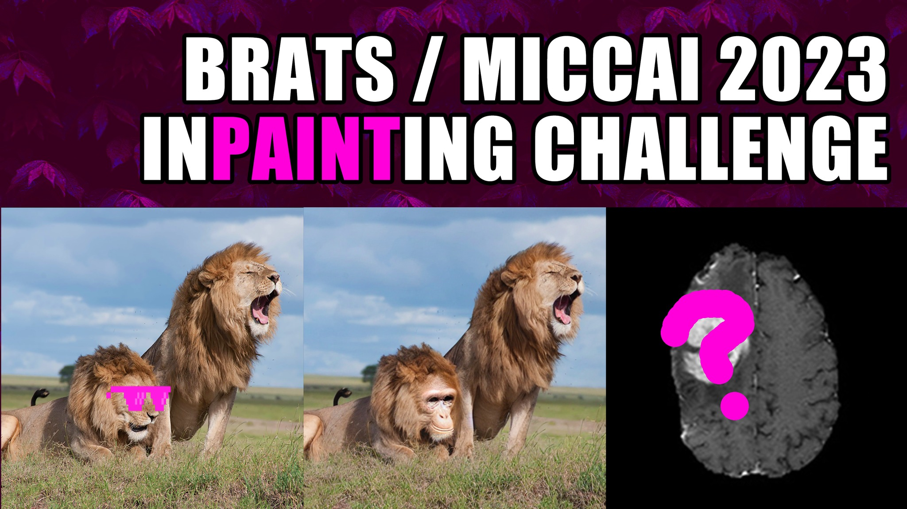

> ATTENTION: The BraTS inpainting challenge 2023 is finished. We want to thank everybody who contributed to this event. Please follow us [here](https://x.com/BraTS_inpaint), to stay updated regarding our BraTS inpainting challenges.

# BraTS 2023 Inpainting Challenge (Local Synthesis)

This repository is meant as tutorial for challenge participants. 

If you have not visited the [BraTS 2023 Inpainting Website](https://www.synapse.org/#!Synapse:syn51156910/wiki/622357) yet, you should do so. Also considere reading [the challenge manuscript](https://arxiv.org/abs/2305.08992) for more context as the GitHub tutorial are rather technical in nature.

This repository is divided into three subtopics with a separate README file each.
- **Dataset**: *dataset/README.md*  
    Gives an overview of the challenge training dataset. Also includes the algorithm we used to generate the dataset.
- **Baseline Model**: *baseline/README.md*
    Explains the creation of the baseline model. Also includes performance evaluations. You might want to use this chapter as starting point for your own (better) model!
- **Evaluation**: *evaluation/README.md*
    Shows how out evaluation script works on the Synapse server using out baseline model as example. During the validation phase you will need to [upload predictions](https://www.synapse.org/#!Synapse:syn51156910/wiki/622349) to the Synapse server.
- **Submission**: *submission/README.md*
    Guides you tough the [synapse submission process](https://www.synapse.org/#!Synapse:syn51156910/wiki/622349) using our baseline model as example.\* This is relevant for the final submission where you will upload your whole model to Synapse.\*
