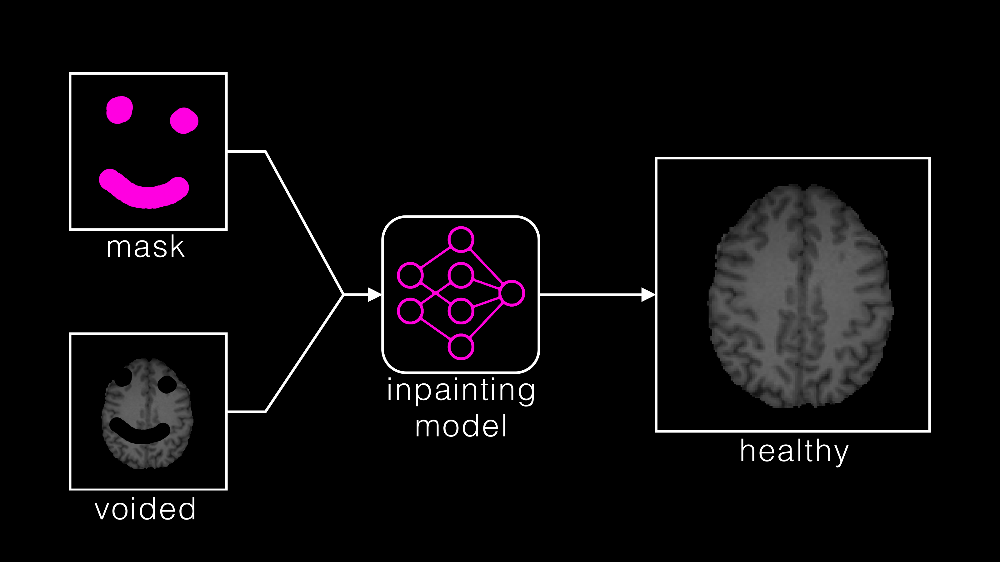

# Baseline Inpainting Model(s)

This sub-repository implements two explanatory models to tackle the inpainting challenge.
Both models shall serve as a comparison for your implemented model. 

  1. A 3D Pix2Pix network (see train_Pix2Pix3D.py)
  2. (optional) A 3D AutoEncoder (see train_AE.py)



## Requirements/Installation

- Download the training dataset from [here](https://www.synapse.org/#!Synapse:syn51523038) and unzip it into the root of this repository (```2023_challenge/```)
- Download the trained baseline model from [here](
https://syncandshare.lrz.de/dl/fiWmxMzsnrWyY3yAja85JE/lightning_logs.zip) and unzip it into ```2023_challenge/baseline/``` (this folder).
- Create a new python environment. We recommend python version 3.10
- Check your cuda version ```nvidia-smi``` (top right)
- Install required python packages:
  - ```torch``` and ```torchvision``` which are compatible with your cuda version (See https://pytorch.org/). Note however, that for ```pytorch<1.13```, you might encounter [issues](https://github.com/BraTS-inpainting/2023_challenge/issues/1) with our code. Use ```pytorch>=2.0.0``` if possible
  - ```pytorch-lightning```
  - ```matplotlib```
  - ```nibabel```
  - ```tensorboard```
  - ```jupyter```
  - ```scipy```
  - ```tqdm```

For example with conda and current CUDA version 11.7
```
conda create -n infill python=3.10
conda activate infill
conda install "pytorch>=2.0.0" torchvision torchaudio pytorch-cuda=11.7 -c pytorch -c nvidia
conda install -c conda-forge pytorch-lightning matplotlib nibabel tensorboard scipy tqdm
conda install -c anaconda jupyter

```
## Getting Started

Look at the ```baseline_model.ipynb```. It will lead you through this repository.
