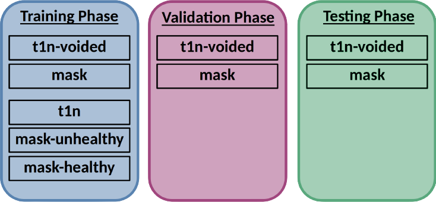

# The Dataset
The [dataset for training](https://www.synapse.org/#!Synapse:syn51522870) can be downloaded on the official Synapse website after [registering for the challenge](https://www.synapse.org/#!Synapse:syn51156910/wiki/622347).

## Dataset structure
The ```ASNR-MICCAI-BraTS2023-Local-Synthesis-Challenge-Training``` folder contains one sub-folder for each brain.
Each brain folder is named ```BraTS-GLI-{case_ID}-{timepoint}``` with ```{case_ID}``` being a 5 digit integer (leading zeros) and ```{timepoint}``` a 3 digit integer (Example: ```BraTS-GLI-01337-001```). Within each brain folder, all files have the brain folder name as ```{prefix}``` and ```.nii.gz``` as file extension (NIfTI files). The complete filename also includes the file ```{type}```, resulting in ```{prefix}-{type}.nii.gz``` as formatting (Example: ```BraTS-GLI-01337-001-t1n-voided.nii.gz```). 

The following entries for ```{type}``` exist in this inpainting challenge:



### File Types
- **t1n-voided**: T1 scan where the **to-be-infilled** section is voided (set to background). 
- **mask**: mask (binary) specifying which voxels **shall be in-painted**. 
- **t1n**: full T1 scan including the **ground truth** for the voided T1 image.
- **mask-unhealthy**: mask (binary) specifying the (slightly enlarged) **tumor region**.
- **mask-healthy**: mask (binary) specifying an exemplary **healthy tissue region**.

Note that your inpainting algorithm has to be able to work **only on the mask and the t1n-voided file**. The additionally provided files during the training phase are only meant for enhancing the training process (e.g. when participants want to generate more/different training data)

## Dataset generation (optional)
It is also possible to generate the ```ASNR-MICCAI-BraTS2023-Local-Synthesis-Challenge-Training``` dataset locally. The Jupyter Notebook ```dataset_generation.ipynb``` contains a step-by-step guide to generate our dataset. Example pictures as well as some documentation is also provided there. Note that our dataset is based on the general BraTS2023-GLI-Challenge-TrainingData. Therefore, to generate our dataset you first need to download and extract [ASNR-MICCAI-BraTS2023-GLI-Challenge-TrainingData.zip](https://www.synapse.org/#!Synapse:syn51514132).

### Requirements
- A python3 environment containing the following packages: ```numpy pandas nibabel scipy tqdm matplotlib jupyter```


